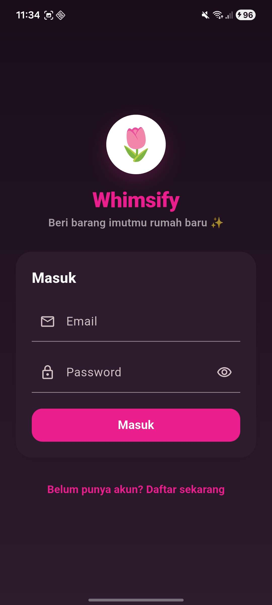
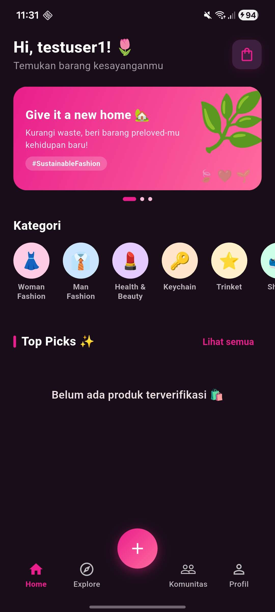
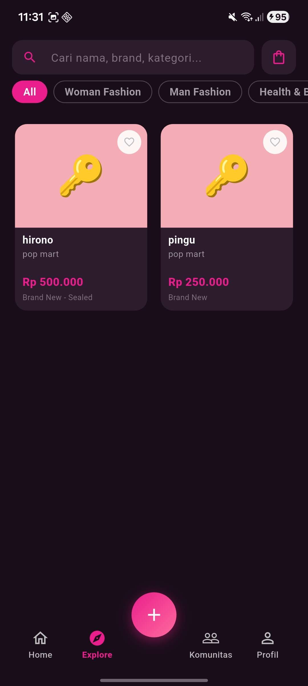
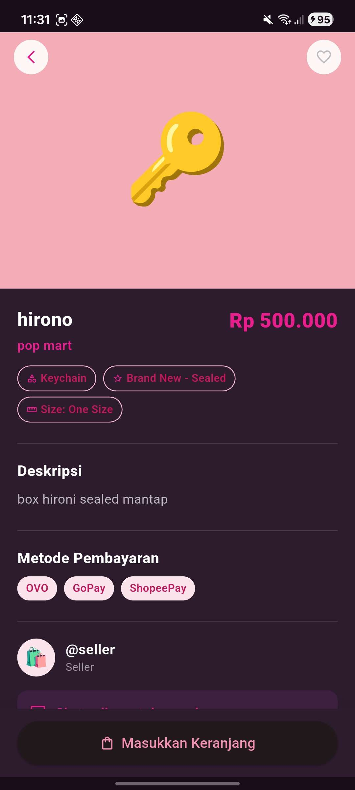
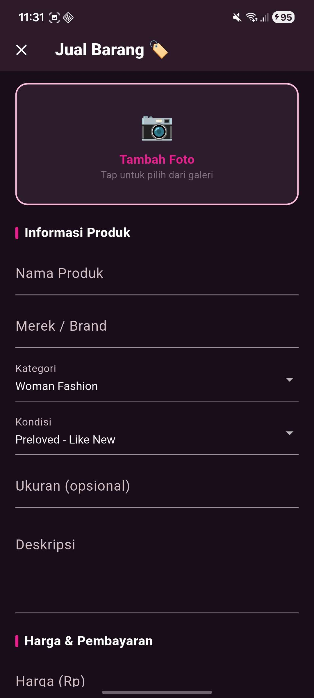
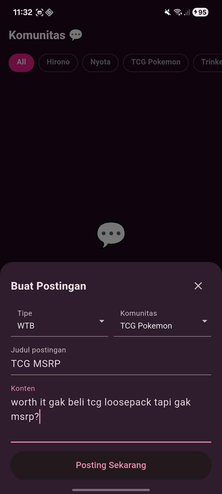
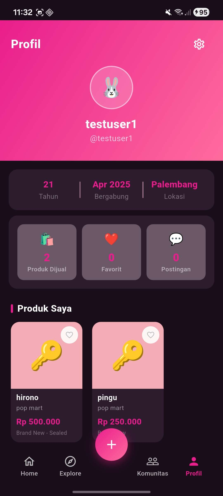
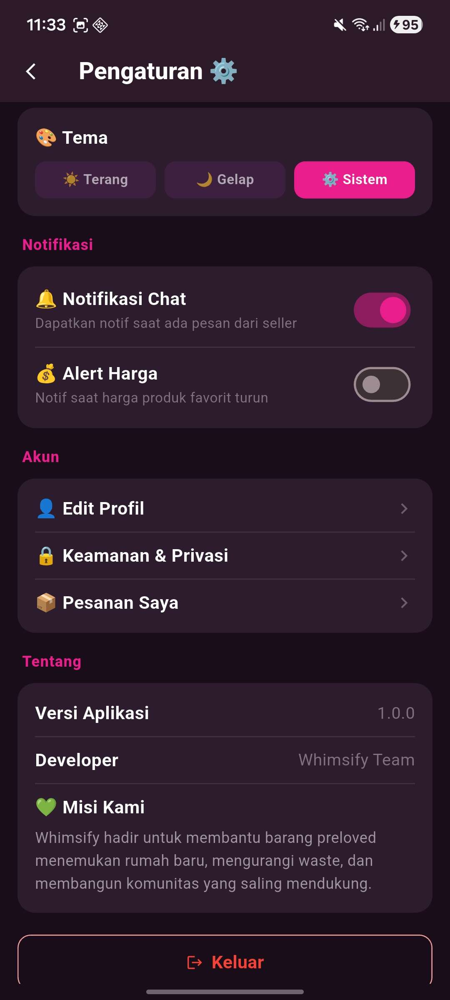
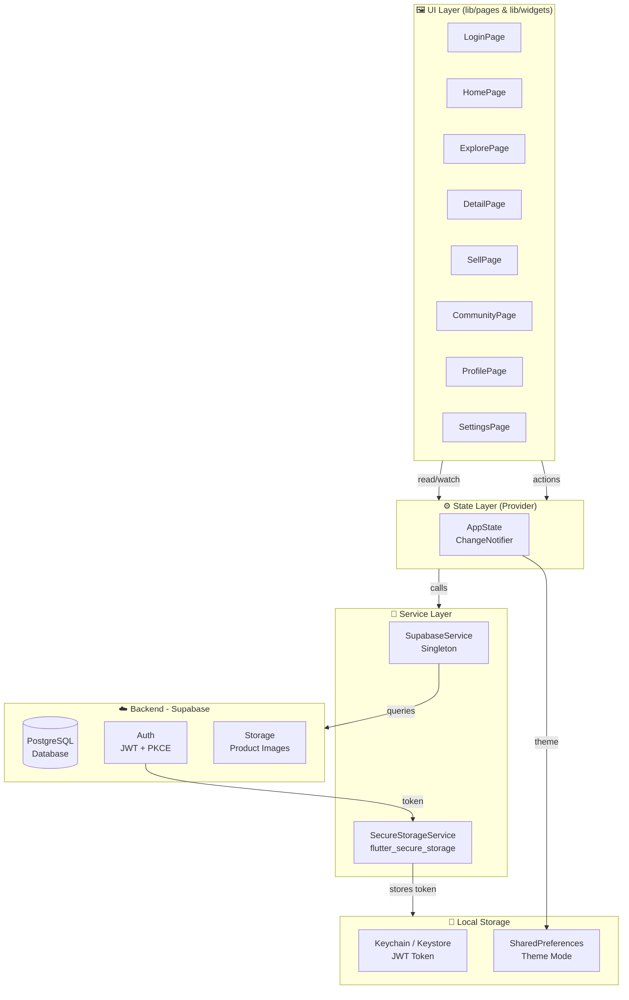

# 🌷 Whimsify — Preloved Marketplace App

> *Give your cute items a new home.*

Whimsify adalah aplikasi mobile marketplace untuk barang-barang preloved bertema whimsical, sebagian besar terinspirasi dari aplikasi Carousell. Cocok buat kamu yang koleksi pernak-pernik, fashion, dan mainan!

---

## Screenshot

<table>
  <tr>
    <td align="center"><b>Login</b></td>
    <td align="center"><b>Home</b></td>
    <td align="center"><b>Explore</b></td>
    <td align="center"><b>Detail</b></td>
  </tr>
  <tr>
    <td></td>
    <td></td>
    <td></td>
    <td></td>
  </tr>
  <tr>
    <td align="center"><b>Sell</b></td>
    <td align="center"><b>Komunitas</b></td>
    <td align="center"><b>Profil</b></td>
    <td align="center"><b>Settings</b></td>
  </tr>
  <tr>
    <td></td>
    <td></td>
    <td></td>
    <td></td>
  </tr>
</table>

---

## Arsitektur Aplikasi

Whimsify menggunakan arsitektur berlapis yang memisahkan UI, state, service, dan data.



## ✨ Fitur Aplikasi

### Home Page
- Sapaan personal dengan nama user
- Tombol keranjang dengan **badge counter dinamis**
- **Banner carousel otomatis** — 3 slide berisi pesan eco-friendly, komunitas, dan promo Kartini 10%
- **Slider kategori** horizontal: Woman Fashion, Man Fashion, Health & Beauty, Keychain, Trinket, Shoes, Playing Card, Sticker
- **Top Picks** — grid produk dari seller terverifikasi, responsif mengikuti ukuran layar
- Tombol favorit ❤️ per produk dengan perubahan state lokal

### Explore Page
- Search bar full-featured (nama, brand, kategori, deskripsi, username seller)
- Filter kategori horizontal dengan animasi chip
- Counter hasil pencarian
- Empty state saat tidak ada hasil
- GridView responsif: mobile 2 kolom, tablet 3 kolom, desktop 4 kolom

### Detail Page
- **Hero animation** dari Home ke Detail
- Info lengkap produk: nama, brand, harga, kondisi, ukuran, kategori, deskripsi
- Metode pembayaran yang diterima seller
- Info seller + badge verified
- Toggle chat untuk nego harga ke seller
- Tombol tambah ke keranjang

### Sell Page
- Input foto placeholder (simulasi galeri)
- Form: Nama produk, Brand, Kategori (dropdown), Kondisi (dropdown), Ukuran, Deskripsi
- Input harga + chip pilihan metode pembayaran (multi-select)
- Validasi form lengkap: field kosong & minimal karakter
- **PopScope** — konfirmasi dialog sebelum keluar jika form belum disimpan
- Produk langsung muncul di Explore & Home setelah listing berhasil
- Layout responsif via `LayoutBuilder`: mobile 1 kolom, tablet 2 kolom

### Komunitas Page
- Filter komunitas: Hirono, Nyota, TCG Pokémon, Trinket, Mofusand, Snoopy, Labubu, Molly
- Post bertipe **WTS / WTB / Discussion** (color-coded)
- Klik post → modal bottom sheet percakapan + kolom reply
- FAB untuk buat postingan baru (tipe, komunitas, judul, konten)
- Timestamp relatif (*x menit / jam / hari yang lalu*)

### Profile Page
- Avatar, nama, username
- Info: umur, tanggal bergabung, lokasi
- Statistik: produk dijual, favorit, postingan komunitas
- Horizontal scroll produk yang sedang dijual user
- Daftar postingan komunitas user

### Settings Page
- Toggle tema: **Terang / Gelap / Sistem**
- `Switch.adaptive` — mengikuti platform Android/iOS
- Toggle notifikasi: chat & price alert
- Info versi aplikasi & misi Whimsify
- Konfirmasi dialog saat logout

### Cart Page
- Daftar produk di keranjang
- Total harga otomatis
- Tombol checkout
- Empty state dengan CTA ke Explore

---

## Teknologi & Dependensi

| Package | Versi | Kegunaan |
|---|---|---|
| `flutter` | SDK | Framework utama |
| `provider` | `^6.1.1` | State management global |
| `supabase_flutter` | `^2.6.0` | Backend & autentikasi |
| `flutter_secure_storage` | `^9.2.2` | Simpan JWT token di Keychain/Keystore |
| `shared_preferences` | `^2.3.2` | Simpan preferensi tema |
| `flutter_dotenv` | `^5.1.0` | Manajemen environment variable |
| `shimmer` | `^3.0.0` | Loading skeleton effect |
| `image_picker` | `^1.1.2` | Pilih gambar dari galeri/kamera |

**Dart SDK:** `>=3.3.0 <4.0.0`

---

## Backend

Aplikasi ini menggunakan **[Supabase](https://supabase.com)** sebagai backend-as-a-service.

||---|---|
| **Database** | PostgreSQL via Supabase |
| **Auth** | Supabase Auth — JWT + PKCE flow |
| **Storage** | Supabase Storage bucket `product_images` |
| **Token Storage** | `flutter_secure_storage` → Keychain (iOS) / EncryptedSharedPreferences (Android) |

### Tabel Database

| Tabel | Kolom Utama | Keterangan |
|---|---|---|
| `profiles` | `id`, `username`, `avatar_url`, `is_verified` | Data profil user |
| `products` | `id`, `name`, `brand`, `category`, `price`, `condition`, `seller_id`, `image_url` | Listing produk |
| `favorites` | `user_id`, `product_id` | Produk yang di-favorit |
| `cart_items` | `user_id`, `product_id`, `quantity` | Item di keranjang |
| `community_posts` | `id`, `user_id`, `community`, `type`, `title`, `content` | Postingan komunitas |
| `post_likes` | `user_id`, `post_id` | Like postingan |
| `community_replies` | `post_id`, `user_id`, `content` | Balasan postingan |


### Konfigurasi `.env`

Buat file `.env` di root project dan isi dengan:

```env
SUPABASE_URL=https://your-project.supabase.co
SUPABASE_ANON_KEY=your-anon-key
```


---

## Cara Menjalankan Aplikasi

### Prasyarat

Pastikan kamu sudah menginstall:

- [Flutter SDK](https://docs.flutter.dev/get-started/install) (versi stable terbaru, Dart `>=3.0.0`)
- [Android Studio](https://developer.android.com/studio) atau [VS Code](https://code.visualstudio.com/) dengan ekstensi Flutter
- Emulator Android/iOS atau perangkat fisik
- Akun [Supabase](https://supabase.com) (untuk backend)

### Langkah-Langkah

**1. Clone repository**
```bash
git clone https://github.com/inezthing/Midterm-Mobile-Development-GDGoC-Unsri.git
cd Midterm-Mobile-Development-GDGoC-Unsri
```

**2. Install dependensi**
```bash
flutter pub get
```

**3. Setup environment variable**

Buat file `.env` di root project:
```bash
cp .env.example .env   # jika tersedia, atau buat manual
```
Isi dengan Supabase URL dan Anon Key kamu (lihat bagian Backend di atas).

**4. Jalankan aplikasi**
```bash
# Pastikan emulator/device sudah aktif
flutter run
```

Untuk build release APK:
```bash
flutter build apk --release
```

---

## 📁 Struktur Proyek

```
lib/
├── main.dart                  # Root app + ChangeNotifierProvider + bottom navigation
├── theme/
│   └── app_theme.dart         # ThemeData light & dark, ColorScheme.fromSeed
├── models/
│   └── models.dart            # Product, CommunityPost, CartItem
├── data/
│   ├── mock_data.dart         # Data lokal hardcoded (produk & komunitas)
│   ├── app_state.dart         # ChangeNotifier — state management global
│   └── secure_storage_service.dart  # JWT storage di Keychain/Keystore
├── pages/
│   ├── home_page.dart         # StatelessWidget, CustomScrollView, SliverGrid
│   ├── explore_page.dart      # StatefulWidget, search + filter + GridView
│   ├── detail_page.dart       # StatefulWidget, Hero, chat toggle, add to cart
│   ├── sell_page.dart         # StatefulWidget, Form + PopScope + LayoutBuilder
│   ├── community_page.dart    # StatefulWidget, post list + bottom sheet reply
│   ├── profile_page.dart      # StatelessWidget + Consumer, stats + product list
│   ├── settings_page.dart     # StatefulWidget, Switch.adaptive, theme toggle
│   └── cart_page.dart         # StatelessWidget + Consumer, cart list + checkout
└── widgets/
    ├── product_card.dart       # StatelessWidget + Consumer (favorit)
    ├── banner_carousel.dart    # StatefulWidget, PageView + Timer auto-slide
    └── category_slider.dart   # StatefulWidget, horizontal ListView
```


